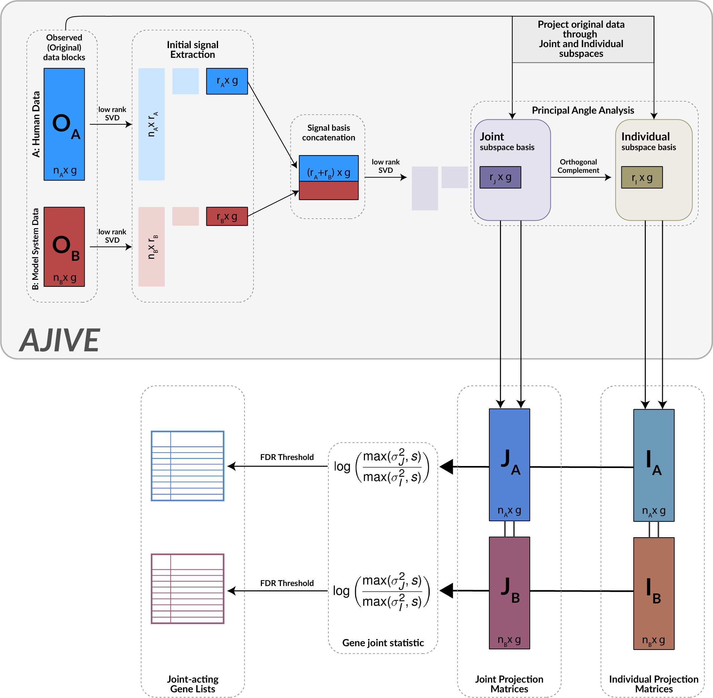

# Genewise-Cohort-Integration

Brandon A. Price, J.S. Marron, Lisle E. Mose, Charles M. Perou, Joel S. Parker. (2021). Translating genomic findings from model systems to humans through joint dimension reduction. *Under Review*.

Improving clinical translation of model system genomics through joint dimension reduction and horizontal data integration.

